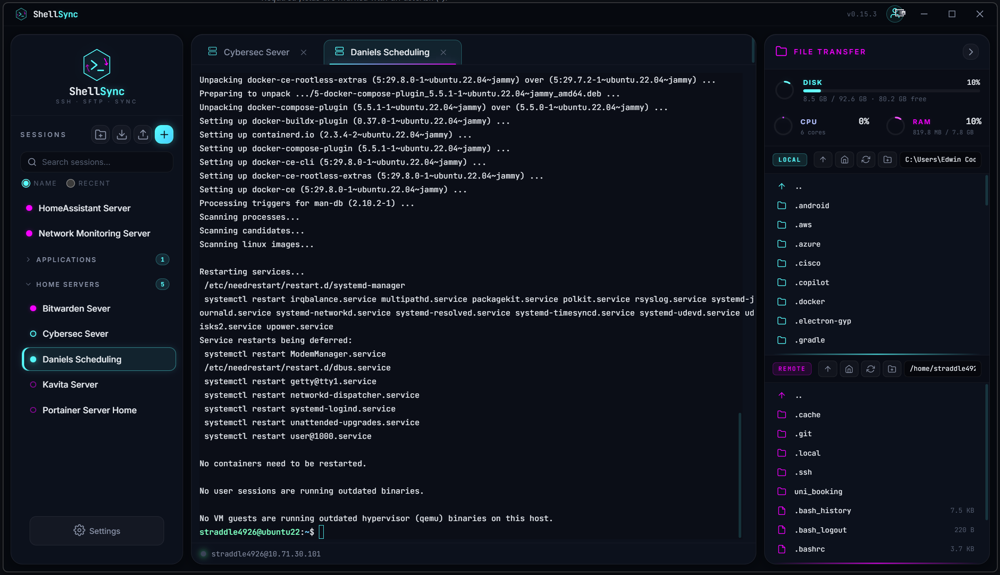

# ShellSync

A daily-driver SSH and RDP client for Windows, built around ergonomics and honest defaults.

<!-- TODO: Replace with a real screenshot once available -->


## What it is

ShellSync is a personal SSH/RDP client I built because I wanted something that felt like SolarPuTTY (which I like) but that I actually maintain and can shape to my own workflow. It's designed for managing home lab and work Linux servers, plus Windows machines via RDP, in one window.

**Highlights:**

- Multi-session tabbed terminal with a floating three-column layout (session tree, terminal, file transfer panel)
- SFTP file browser with dual-pane transfer confirmation
- RDP support via native `mstsc.exe` (uses Windows Credential Manager — ShellSync never touches your RDP passwords)
- Real-time server stats (Disk / CPU / RAM) via SSH
- Prompt-aware smart paste — pastes multi-line scripts without eating `sudo` password prompts
- App Login (optional launch password gate)
- DPAPI-encrypted SSH session passwords, host-key TOFU verification, SSH agent support (Pageant / Windows OpenSSH)
- Custom color themes with a save-your-own-preset feature

## What it isn't

- A commercial product with support SLAs
- A replacement for Royal TS, Devolutions RDM, or MobaXterm if you need enterprise features (team credential vaults, HSM integration, compliance certifications)
- Code-signed (yet). Windows will show a SmartScreen warning on first install — see the install section for how to handle that

## Install

**Requirements:** Windows 10 or 11, 64-bit.

1. Go to [Releases](https://github.com/LetsGetCracking/shellsync/releases)
2. Download the latest `ShellSync-Setup-X.Y.Z.exe`
3. (Optional but recommended) Verify the SHA256 hash — see `SHA256SUMS.txt` next to the installer
4. Run the installer
5. **Windows SmartScreen warning:** because the binary isn't code-signed, Windows will show "Windows protected your PC." Click **More info → Run anyway**. This is expected — it doesn't mean anything is wrong, just that Microsoft doesn't recognize the publisher yet
6. Follow the installer prompts

To verify the SHA256 hash yourself (recommended for anything security-relevant):

```powershell
Get-FileHash .\ShellSync-Setup-X.Y.Z.exe -Algorithm SHA256
```

Compare to the value in `SHA256SUMS.txt`.

## Building from source

Want to build ShellSync yourself instead of trusting the released binary? See [BUILDING.md](BUILDING.md) for full instructions. Short version:

```powershell
git clone https://github.com/LetsGetCracking/shellsync.git
cd shellsync
npm install
$env:CSC_IDENTITY_AUTO_DISCOVERY="false"
npm run build
```

The installer will be at `dist\ShellSync-Setup-X.Y.Z.exe`.

## Security posture

Short version: **credentials are encrypted with Windows DPAPI (same mechanism Chrome and Edge use), SSH host keys are verified with strict TOFU, and passwords are never persisted in plaintext.** RDP passwords go straight to Windows Credential Manager — ShellSync never stores them.

Full details, including what's protected and what isn't, live in [SECURITY.md](SECURITY.md).

If you find a security bug, **please email me directly** rather than opening a public issue. Contact details in SECURITY.md.

## Support and expectations

This is a personal project. I use ShellSync daily, so bugs that affect me get fixed quickly. Bugs that don't affect me get fixed when I have time. If you file an issue expect a response within a couple weeks, and a fix on whatever cadence I can manage.

If you need enterprise-grade support, this isn't the tool for you — try [Royal TS](https://www.royalapps.com/), [Devolutions RDM](https://devolutions.net/remote-desktop-manager/), or [MobaXterm](https://mobaxterm.mobatek.net/).

## Contributing

Right now this is a personal project and I'm not accepting external code contributions — but bug reports and feature suggestions via GitHub issues are welcome. If you have a security issue, see [SECURITY.md](SECURITY.md) for the private disclosure process.

## License

MIT License — see [LICENSE](LICENSE) for details. In short: do what you want with it, don't blame me if it breaks.

## Acknowledgments

Built on top of:

- [Electron](https://www.electronjs.org/) — cross-platform desktop shell
- [xterm.js](https://xtermjs.org/) — terminal renderer
- [ssh2](https://github.com/mscdex/ssh2) — SSH protocol implementation in Node.js
- Microsoft's `mstsc.exe` and `cmdkey.exe` for RDP and Credential Manager integration

Inspired by SolarPuTTY's terminal ergonomics.

## Changelog

See [CHANGELOG.md](CHANGELOG.md) for the full version history.

---

*ShellSync is not affiliated with SolarWinds, Microsoft, or any of the projects it's built on.*
